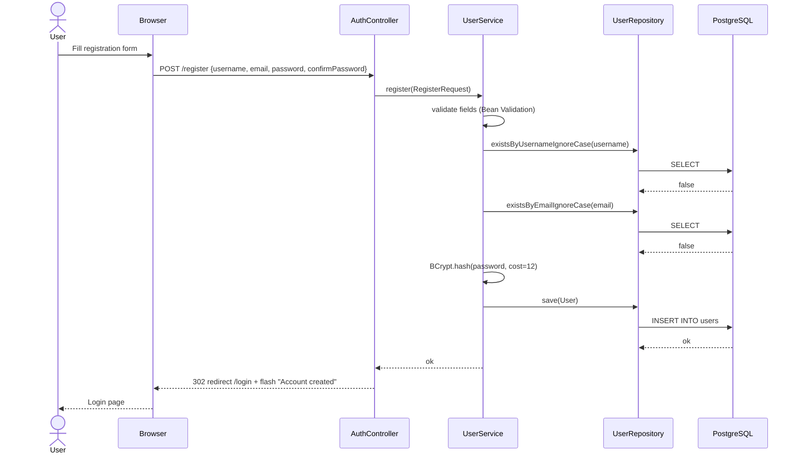
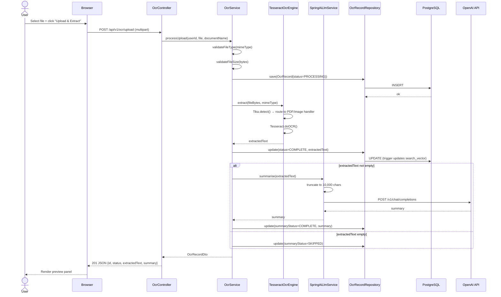
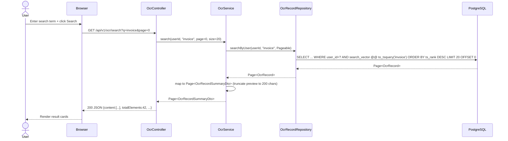
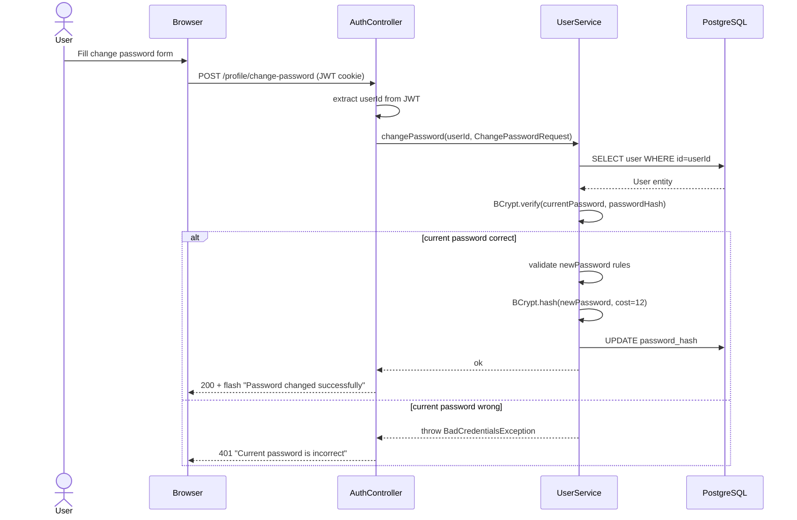
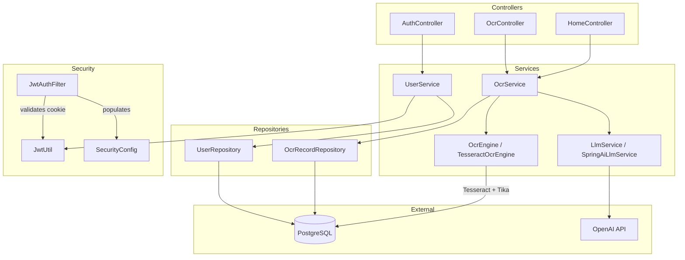

# Design Document: ocr-processor

> **Status:** 🟢 Approved  
> **Phase:** 3 of 6  
> **Last Updated:** 2025-07-14

---

## 1. Overview

This document covers UI wireframes, page flows, sequence diagrams, component interactions, and detailed design decisions for all 7 requirements. It is the direct blueprint for Phase 4 implementation.

---

## 2. Navigation & Page Flow

```
                    ┌─────────────┐
         ┌─────────►│  /register  │
         │          └──────┬──────┘
         │     success     │
         │          ┌──────▼──────┐
[Browser]────────►  │   /login    │◄──── all protected routes (unauthenticated)
                    └──────┬──────┘
               JWT cookie  │  success
                    ┌──────▼──────────────────────────┐
                    │            /home                │
                    │  ┌──────────────┬─────────────┐ │
                    │  │ Search Tab   │ Create Tab  │ │
                    │  │  (default)   │             │ │
                    │  └──────┬───────┴──────┬──────┘ │
                    └─────────┼──────────────┼────────┘
                              │              │
                    ┌─────────▼──┐    ┌──────▼──────────┐
                    │/ocr/{id}   │    │ Upload + Preview │
                    │ Detail View│    │  (inline panel) │
                    └────────────┘    └─────────────────┘
                              │
                    ┌─────────▼──────────┐
                    │/profile/change-    │
                    │  password          │
                    └────────────────────┘
```

---

## 3. UI Wireframes

### 3.1 Registration Page — `/register`

```
┌─────────────────────────────────────────────────────┐
│               ocr-processor                         │
│                                                     │
│              Create an Account                      │
│                                                     │
│  Username  ┌──────────────────────────────────┐     │
│            │                                  │     │
│            └──────────────────────────────────┘     │
│            ⚠ Username already taken                 │
│                                                     │
│  Email     ┌──────────────────────────────────┐     │
│            │                                  │     │
│            └──────────────────────────────────┘     │
│                                                     │
│  Password  ┌──────────────────────────────────┐     │
│            │ ••••••••                          │     │
│            └──────────────────────────────────┘     │
│            ⚠ Password must be at least 8 characters │
│                                                     │
│  Confirm   ┌──────────────────────────────────┐     │
│  Password  │ ••••••••                          │     │
│            └──────────────────────────────────┘     │
│                                                     │
│            ┌──────────────────────────────────┐     │
│            │         Register                 │     │
│            └──────────────────────────────────┘     │
│                                                     │
│            Already have an account? Login           │
└─────────────────────────────────────────────────────┘
```

**Behaviour:**
- All validation errors shown inline below each field
- On success → redirect to `/login` with flash message: "Account created. Please log in."
- "Login" link → `/login`

---

### 3.2 Login Page — `/login`

```
┌─────────────────────────────────────────────────────┐
│               ocr-processor                         │
│                                                     │
│                    Login                            │
│                                                     │
│  ┌─────────────────────────────────────────────┐   │
│  │  ✓ Account created. Please log in.          │   │  ← flash (conditional)
│  └─────────────────────────────────────────────┘   │
│                                                     │
│  Username  ┌──────────────────────────────────┐     │
│            │                                  │     │
│            └──────────────────────────────────┘     │
│                                                     │
│  Password  ┌──────────────────────────────────┐     │
│            │ ••••••••                          │     │
│            └──────────────────────────────────┘     │
│                                                     │
│  ⚠ Invalid username or password                    │  ← error (conditional)
│                                                     │
│            ┌──────────────────────────────────┐     │
│            │             Login                │     │
│            └──────────────────────────────────┘     │
│                                                     │
│            Don't have an account? Register          │
└─────────────────────────────────────────────────────┘
```

**Behaviour:**
- On success → set JWT HTTP-only cookie; redirect to `/home`
- On lockout → show: "Account temporarily locked. Try again later."
- "Register" link → `/register`

---

### 3.3 Home Page — `/home`

```
┌─────────────────────────────────────────────────────────────────┐
│  ocr-processor        Welcome, alice          [Change Password] [Logout] │
├─────────────────────────────────────────────────────────────────┤
│                                                                 │
│  ┌──────────────────┐  ┌──────────────────┐                    │
│  │  🔍 Search       │  │  ➕ Create        │                    │
│  └──────────────────┘  └──────────────────┘                    │
│  ══════════════════════════════════════════                     │
│                                                                 │
│  [Active tab content renders here — see 3.3a / 3.3b]           │
│                                                                 │
└─────────────────────────────────────────────────────────────────┘
```

**Behaviour:**
- Search tab active by default on page load
- Tab switch updates URL hash (`#search` / `#create`) without full reload
- Navbar always visible; username and action links shown

---

### 3.3a Search Tab (default)

```
│  ┌─────────────────────────────────────────┐  ┌──────────┐    │
│  │  Search documents…                      │  │  Search  │    │
│  └─────────────────────────────────────────┘  └──────────┘    │
│                                                                 │
│  Showing 42 results for "invoice"                               │
│                                                                 │
│  ┌─────────────────────────────────────────────────────────┐   │
│  │  📄 Invoice_March_2024.pdf            2025-07-01  COMPLETE│  │
│  │  "Total amount due: $4,250.00. Payment terms: Net 30…"  │   │
│  └─────────────────────────────────────────────────────────┘   │
│  ┌─────────────────────────────────────────────────────────┐   │
│  │  📄 Contract_Renewal.pdf              2025-06-28  COMPLETE│  │
│  │  "This agreement is entered into between Party A and…"  │   │
│  └─────────────────────────────────────────────────────────┘   │
│                                                                 │
│           ← 1  [2]  3 →                                        │
└─────────────────────────────────────────────────────────────────┘
```

**Behaviour:**
- Clicking a result card → `/ocr/{id}` detail view
- Empty search → shows all user records, paginated
- Results show document name, upload date, status badge, 200-char preview

---

### 3.3b Create Tab

```
│                                                                 │
│  Document Name  ┌────────────────────────────────────────┐     │
│                 │  Invoice_March_2024                    │     │
│                 └────────────────────────────────────────┘     │
│                                                                 │
│  ┌──────────────────────────────────────────────────────────┐  │
│  │                                                          │  │
│  │        Drag & drop a file here, or click to browse       │  │
│  │        PDF · PNG · JPG · JPEG · TIFF  (max 20 MB)        │  │
│  │                                                          │  │
│  └──────────────────────────────────────────────────────────┘  │
│                                                                 │
│  ┌────────────────────────┐                                     │
│  │   Upload & Extract     │                                     │
│  └────────────────────────┘                                     │
│                                                                 │
│  ── After upload ──────────────────────────────────────────    │
│                                                                 │
│  ✓ Extraction complete                   Status: COMPLETE       │
│                                                                 │
│  Extracted Text                                                 │
│  ┌──────────────────────────────────────────────────────────┐  │
│  │  Total amount due: $4,250.00                             │  │
│  │  Payment terms: Net 30 days from invoice date            │  │
│  │  …                                                       │  │
│  └──────────────────────────────────────────────────────────┘  │
│                                                                 │
│  AI Summary                                                     │
│  ┌──────────────────────────────────────────────────────────┐  │
│  │  This invoice for $4,250 is due within 30 days. It       │  │
│  │  covers professional services rendered in March 2024…    │  │
│  └──────────────────────────────────────────────────────────┘  │
└─────────────────────────────────────────────────────────────────┘
```

**Behaviour:**
- File drop zone highlights on drag-over
- Progress spinner shown during upload + OCR (replaces button)
- Preview panel animates in after completion
- "Retry Summary" button shown if `summaryStatus = FAILED`

---

### 3.4 OCR Record Detail Page — `/ocr/{id}`

```
┌─────────────────────────────────────────────────────────────────┐
│  ocr-processor        Welcome, alice          [Change Password] [Logout] │
├─────────────────────────────────────────────────────────────────┤
│  ← Back to Search                                               │
│                                                                 │
│  Invoice_March_2024.pdf                                         │
│  Uploaded: 2025-07-01 14:32  ·  Status: ✅ COMPLETE             │
│  File: PDF  ·  102 KB                                           │
│                                                                 │
│  ─── Extracted Text ────────────────────────────────────────   │
│  Total amount due: $4,250.00                                    │
│  Payment terms: Net 30 days from invoice date                   │
│  Invoice #: INV-2024-0312                                       │
│  …                                                              │
│                                                                 │
│  ─── AI Summary ────────────────────────────────────────────   │
│  This invoice for $4,250 is due within 30 days of the          │
│  invoice date (March 12, 2024). It covers professional          │
│  services rendered in Q1 2024.                                  │
│                                                                 │
│           [Retry Summary]   ← only shown if summaryStatus=FAILED│
└─────────────────────────────────────────────────────────────────┘
```

---

### 3.5 Change Password Page — `/profile/change-password`

```
┌─────────────────────────────────────────────────────┐
│  ocr-processor        Welcome, alice     [Logout]    │
├─────────────────────────────────────────────────────┤
│                                                     │
│              Change Password                        │
│                                                     │
│  Current Password  ┌────────────────────────────┐  │
│                    │ ••••••••                    │  │
│                    └────────────────────────────┘  │
│                    ⚠ Current password is incorrect  │
│                                                     │
│  New Password      ┌────────────────────────────┐  │
│                    │ ••••••••                    │  │
│                    └────────────────────────────┘  │
│                                                     │
│  Confirm Password  ┌────────────────────────────┐  │
│                    │ ••••••••                    │  │
│                    └────────────────────────────┘  │
│                                                     │
│  ┌────────────────────────────────────────────┐    │
│  │           Change Password                  │    │
│  └────────────────────────────────────────────┘    │
│                                                     │
│  ✓ Password changed successfully   ← flash msg      │
│                                                     │
│  ← Back to Home                                     │
└─────────────────────────────────────────────────────┘
```

---

## 4. Sequence Diagrams

### 4.1 User Registration



---

### 4.2 User Login + JWT Issuance

```mermaid
sequenceDiagram
    actor User
    participant Browser
    participant AuthController
    participant UserService
    participant JwtUtil
    participant DB as PostgreSQL

    User->>Browser: Submit login form
    Browser->>AuthController: POST /login {username, password}
    AuthController->>UserService: login(LoginRequest)
    UserService->>DB: SELECT user WHERE LOWER(username)=?
    DB-->>UserService: User entity
    UserService->>UserService: check lockedUntil (if set and future → throw AccountLockedException)
    UserService->>UserService: BCrypt.verify(password, passwordHash)
    alt Password correct
        UserService->>DB: UPDATE failed_login_attempts=0
        UserService->>JwtUtil: generateToken(userId, username)
        JwtUtil-->>UserService: jwtString
        UserService-->>AuthController: AuthResult{jwtString}
        AuthController-->>Browser: 302 /home + Set-Cookie: jwt=...; HttpOnly; Secure; SameSite=Strict
        Browser-->>User: Home page
    else Password wrong
        UserService->>DB: UPDATE failed_login_attempts++
        alt attempts >= 5
            UserService->>DB: UPDATE locked_until = NOW() + 15 min
            UserService-->>AuthController: throw AccountLockedException
            AuthController-->>Browser: 423 "Account temporarily locked"
        else attempts < 5
            UserService-->>AuthController: throw BadCredentialsException
            AuthController-->>Browser: 401 "Invalid username or password"
        end
    end
```

---

### 4.3 OCR Upload + LLM Summarisation



---

### 4.4 Search OCR Records



---

### 4.5 Change Password



---

## 5. Component Interaction Diagram



---

## 6. Thymeleaf Template Structure

```
src/main/resources/templates/
├── layout/
│   └── base.html          ← common navbar + footer fragment
├── auth/
│   ├── login.html
│   ├── register.html
│   └── change-password.html
├── home/
│   └── index.html         ← tabs; includes search.html + create.html fragments
├── home/fragments/
│   ├── search.html        ← search bar + results list
│   └── create.html        ← upload form + preview panel
└── ocr/
    └── detail.html        ← full OCR record view

src/main/resources/static/
├── css/
│   └── app.css
└── js/
    ├── tabs.js            ← tab switch logic (hash-based)
    └── upload.js          ← drag-drop + progress + AJAX upload
```

---

## 7. Data Transfer Objects (DTOs)

### RegisterRequest
```java
record RegisterRequest(
    @NotBlank @Size(min=3, max=50) String username,
    @NotBlank @Email @Size(max=254) String email,
    @NotBlank @Size(min=8, max=128) String password,
    @NotBlank String confirmPassword
) {}
```

### LoginRequest
```java
record LoginRequest(
    @NotBlank String username,
    @NotBlank String password
) {}
```

### ChangePasswordRequest
```java
record ChangePasswordRequest(
    @NotBlank String currentPassword,
    @NotBlank @Size(min=8, max=128) String newPassword,
    @NotBlank String confirmPassword
) {}
```

### OcrRecordDto (full detail)
```java
record OcrRecordDto(
    UUID id,
    String documentName,
    String originalFilename,
    String fileType,
    Long fileSizeBytes,
    String status,
    String summaryStatus,
    String extractedText,
    String summary,
    Instant createdAt,
    Instant updatedAt
) {}
```

### OcrRecordSummaryDto (search result card)
```java
record OcrRecordSummaryDto(
    UUID id,
    String documentName,
    String status,
    String preview,       // extractedText truncated to 200 chars
    Instant createdAt
) {}
```

---

## 8. Status State Machines

### OcrRecord.status
```
PENDING ──► PROCESSING ──► COMPLETE
                      └──► FAILED
```

### OcrRecord.summaryStatus
```
PENDING ──► COMPLETE
       └──► FAILED ──► (retry) ──► COMPLETE
       └──► SKIPPED  (empty extractedText)
```

---

## 9. Validation Rules Summary

| Field | Rule |
|---|---|
| username | 3–50 chars, unique (case-insensitive), alphanumeric + underscore |
| email | Valid RFC 5321 format, max 254 chars, unique (case-insensitive) |
| password | 8–128 chars |
| file type | application/pdf, image/png, image/jpeg, image/tiff |
| file size | max 20 MB (20,971,520 bytes) |
| search query | sanitised; special chars escaped; min 0 chars (empty = all) |
| documentName | max 255 chars; defaults to original filename if blank |

---

## 10. Error Response Format

All API error responses follow this envelope:

```json
{
  "status":  400,
  "error":   "Bad Request",
  "message": "Human-readable summary",
  "errors":  {
    "fieldName": "field-level error message"
  },
  "timestamp": "2025-07-14T12:00:00Z",
  "path":    "/api/v1/ocr/upload"
}
```

`errors` is omitted when there are no field-level details.
